#  FactoryMind AI

Sistema de monitoramento industrial inteligente para Smart Manufacturing, com arquitetura hibrida em Python, NestJS e React. O projeto simula uma fabrica conectada, processa leituras de sensores, calcula KPIs industriais, executa modelos de manutencao preditiva e entrega um dashboard operacional com assistente inteligente.

Repositorio: [SamLoboTi/smart-factory](https://github.com/SamLoboTi/smart-factory)

## Visao Geral

O Smart Factory Project foi criado como uma plataforma demonstravel de Industria 4.0, conectando tres frentes principais:

- monitoramento operacional em tempo real;
- manutencao preditiva com IA;
- interface web para tomada de decisao industrial.

O sistema usa dados simulados de sensores industriais para representar equipamentos como maquinas CNC, compressores, bombas, esteiras e prensas. A camada de IA estima risco de falha, detecta anomalias, calcula vida util restante (RUL) e explica os principais motivos da previsao.




Versao interativa: [`docs/interactive-architecture.html`](docs/interactive-architecture.html)

## Principais Recursos

### Monitoramento Industrial

- Leitura de sensores de temperatura, vibracao e pressao.
- Dashboard React com KPIs, graficos e indicador de risco.
- Atualizacao periodica da interface.
- Visualizacao de paradas, status operacional e alertas.

### Manutencao Preditiva com IA

- Dataset sintetico industrial enriquecido.
- Features como temperatura, vibracao, corrente eletrica, rotacao, carga da maquina, turno, tipo de equipamento e historico de manutencao.
- Predicao de falha por equipamento.
- Deteccao de anomalias com Isolation Forest.
- Estimativa de RUL, vida util restante.
- Explicacao textual da previsao.
- Versionamento inicial de modelos em `models/`.

### Assistente Inteligente

O assistente foi aprimorado para responder perguntas naturais sobre o sistema, por exemplo:

- `qual e a previsao analisada`
- `tem anomalia?`
- `como esta o OEE?`
- `explique o MTBF`
- `status geral`
- `sensores`
- `alertas ativos`
- `recomendacao de manutencao`

Ele consulta os endpoints do backend e retorna respostas com contexto operacional, recomendacoes e explicacoes de IA.

### Alertas Preventivos

- Pre-alerta a partir de 60% de risco.
- Alerta critico a partir de 80% de risco.
- Registro de alertas no banco.
- Notificacoes via WhatsApp/Twilio configuraveis pela tela `/notificacoes`.
- Destinatario salvo em banco separado com criptografia em repouso.
- Cooldown para evitar spam de alertas.
- Deteccao de tendencias anormais antes de falhas criticas.

### Configuracao Segura de WhatsApp

- Tela operacional para cadastrar responsavel e telefone.
- Endpoint seguro no NestJS para salvar a configuracao.
- Credenciais Twilio somente no backend por variaveis de ambiente.
- O React nunca recebe SID, token, numero de origem ou telefone completo.
- Resposta publica sempre mascarada, por exemplo `whatsapp:+********5678`.

### Deploy e Tunnels

- Dockerfiles para backend, frontend e core Python.
- Docker Compose para orquestracao local.
- Suporte a Cloudflare Quick Tunnel para abrir o dashboard em um link publico temporario.

## Arquitetura

O projeto e dividido em tres camadas:

### 1. Core Python

Responsabilidades:

- simular sensores industriais;
- processar pacotes de telemetria;
- persistir leituras em SQLite;
- executar modelos de IA;
- gerar alertas e relatorios;
- treinar e versionar modelos preditivos.

Arquivos principais:

- `run_simulation.py`
- `src/ingestion.py`
- `src/processor.py`
- `src/analytics.py`
- `src/training.py`
- `src/inference_cli.py`
- `src/alert_manager.py`

### 2. Platform NestJS

Responsabilidades:

- expor API REST para o frontend;
- consultar leituras e KPIs;
- orquestrar inferencia Python;
- servir endpoints de IA;
- processar perguntas do assistente inteligente.

Endpoints principais:

- `GET /sensores`
- `GET /kpis`
- `GET /alertas`
- `POST /assistant/chat`
- `POST /predict-failure`
- `POST /detect-anomaly`
- `GET /equipment/:id/risk`
- `GET /notifications/config`
- `POST /notifications/config`
- `POST /notifications/test`

### 3. Frontend React + Vite

Responsabilidades:

- dashboard visual;
- graficos operacionais;
- cards de KPI;
- gauge de risco;
- painel de assistente inteligente;
- alertas visuais para eventos criticos.

Arquivos principais:

- `frontend/src/App.tsx`
- `frontend/src/pages/Dashboard.tsx`
- `frontend/src/components/KPICards.tsx`
- `frontend/src/components/RiskGauge.tsx`
- `frontend/src/components/ChatAssistant.tsx`
- `frontend/src/pages/Notificacoes.tsx`

## Arquitetura Interativa

Abra a visualizacao interativa em:

```text
docs/interactive-architecture.html
```

Ela apresenta o fluxo completo entre sensores, core Python, modelos de IA, banco de dados, API NestJS, dashboard React, assistente inteligente e alertas.

## Machine Learning

O projeto evoluiu de um modelo simples para uma pipeline inicial de manutencao preditiva.

### Dataset

Dataset gerado:

```text
data/synthetic_industrial_maintenance.csv
```

Features:

- temperatura;
- vibracao;
- corrente eletrica;
- rotacao;
- carga da maquina;
- tempo de operacao;
- turno;
- tipo de equipamento;
- historico de manutencao;
- dias desde a ultima manutencao.

Targets:

- falha ocorrida;
- tempo ate a falha.

### Modelos

Modelos comparados ou utilizados:

- Logistic Regression;
- Random Forest com ajuste de hiperparametros;
- Isolation Forest para anomalias;
- Random Forest Regressor para RUL.

Metricas avaliadas:

- precision;
- recall;
- F1-score;
- matriz de confusao;
- ROC-AUC;
- PR-AUC;
- custo de falso negativo.

Relatorio completo:

```text
ML_REPORT.md
models/training_report.md
models/metrics_v1.json
```

Artefatos:

```text
models/failure_model_v1.pkl
models/anomaly_model_v1.pkl
models/rul_model_v1.pkl
models/predictive_maintenance_bundle_v1.pkl
modelo_falha.pkl
```

## Como Rodar com Docker

Pre-requisito:

- Docker Desktop instalado e em execucao.

Suba o ambiente:

```bash
docker compose up --build
```

Se sua instalacao ainda usa o comando antigo:

```bash
docker-compose up --build
```

Portas locais configuradas:

- Frontend: `http://localhost:5174`
- Backend API: `http://localhost:3002`

Observacao: o projeto usa portas alternativas para evitar conflito com outros servicos locais.

## Ativar WhatsApp/Twilio

Crie um arquivo `.env` a partir de `.env.example` e configure:

```bash
TWILIO_ACCOUNT_SID=your_account_sid_here
TWILIO_AUTH_TOKEN=your_auth_token_here
TWILIO_WHATSAPP_NUMBER=whatsapp:+14155238886
NOTIFICATION_DATABASE_PATH=secure-data/notification_config.db
NOTIFICATION_ENCRYPTION_KEY=troque-por-uma-chave-forte
```

Depois suba o sistema e acesse:

```text
http://localhost:5174/notificacoes
```

Na tela de notificacoes, cadastre o responsavel, informe o WhatsApp com codigo do pais e DDD, escolha a severidade minima e envie uma mensagem de teste.

Seguranca aplicada:

- credenciais Twilio ficam apenas no backend;
- telefone do destinatario e criptografado no banco `secure-data/notification_config.db`;
- frontend recebe apenas telefone mascarado;
- CORS e hosts do Vite sao configurados por lista explicita;
- `.trycloudflare.com` nao fica liberado no backend automaticamente.

## Link Publico com Tunelamento

Este projeto pode ser exposto temporariamente com Cloudflare Quick Tunnel. O `docker-compose.yml` tambem sobe um tunel publico automaticamente apontando para o frontend.

Depois de iniciar os containers, copie o link gerado nos logs:

```bash
docker compose logs -f tunnel
```

Exemplo de tunel para o frontend:

```bash
cloudflared tunnel --url http://localhost:5174
```

Exemplo de tunel para a API:

```bash
cloudflared tunnel --url http://localhost:3002
```

Depois de iniciar o tunel, procure nos logs uma URL parecida com:

```text
https://algum-nome.trycloudflare.com
```

Esse sera o link publico temporario. Mantenha os processos locais e o `cloudflared` rodando enquanto estiver usando o link.

Ultimos links usados durante validacao local:

- Frontend: `https://percentage-practitioner-integrated-portions.trycloudflare.com`
- API: `https://roof-happy-basename-instrumentation.trycloudflare.com`

Esses links sao temporarios e podem expirar.

## Tunnel Estavel

Quick Tunnel e util para demonstracao, mas a URL pode expirar. Para uma URL estavel, use uma destas opcoes:

### ngrok com dominio reservado

Configure no ambiente:

```powershell
$env:TUNNEL_PROVIDER="ngrok"
$env:NGROK_DOMAIN="seu-dominio-reservado.ngrok.app"
```

Depois rode:

```powershell
powershell -ExecutionPolicy Bypass -File .\scripts\start-stable-tunnel.ps1
```

### Cloudflare Named Tunnel

Crie um tunnel nomeado na sua conta Cloudflare e aponte o hostname para o frontend local.

Configure:

```powershell
$env:TUNNEL_PROVIDER="cloudflare"
$env:CLOUDFLARE_TUNNEL_NAME="smart-factory"
```

Depois rode:

```powershell
powershell -ExecutionPolicy Bypass -File .\scripts\start-stable-tunnel.ps1
```

Observacao de seguranca: o frontend precisa permitir explicitamente o host publico em `VITE_ALLOWED_HOSTS`. Nao use `allowedHosts: true` em ambiente exposto.

## Como Rodar Manualmente

Use tres terminais.

### 1. Simulacao e Dados

```bash
pip install -r requirements.txt
python run_simulation.py
```

### 2. Backend API

```bash
cd platform
npm install
npm run build
npm run start:prod
```

API local:

```text
http://localhost:3002
```

### 3. Frontend

```bash
cd frontend
npm install
npm run dev -- --host 0.0.0.0 --port 5174
```

Dashboard local:

```text
http://localhost:5174
```

## Treinar os Modelos

Para gerar o dataset sintetico industrial e treinar os modelos:

```bash
python src/training.py
```

Saidas esperadas:

- dataset em `data/synthetic_industrial_maintenance.csv`;
- metricas em `models/metrics_v1.json`;
- relatorio em `models/training_report.md`;
- modelos `.pkl` em `models/`.

## Testes e Build

Backend:

```bash
cd platform
npm run build
npm test -- --runInBand
```

Frontend:

```bash
cd frontend
npm run build
```

Python:

```bash
python -m compileall src
```

## Estrutura de Diretorios

```text
.
├── src/                     # Core Python, IA, ingestao e alertas
├── platform/                # Backend NestJS
├── frontend/                # Dashboard React + Vite
├── models/                  # Modelos versionados e metricas
├── data/                    # Dataset sintetico e banco local
├── docs/                    # Documentacao e arquitetura interativa
├── run_simulation.py        # Simulador principal
├── docker-compose.yml       # Orquestracao local
├── ML_REPORT.md             # Relatorio da pipeline de IA
└── README.md                # Documentacao principal
```

## Maturidade Atual

Este projeto esta em nivel de MVP tecnico/portfolio avancado. Ele demonstra integracao real entre IoT simulado, backend, frontend, IA preditiva, alertas e assistente operacional.

Para evoluir para uma versao enterprise, os proximos passos recomendados sao:

- substituir SQLite por PostgreSQL/TimescaleDB;
- usar broker MQTT real como EMQX, HiveMQ ou Mosquitto;
- adicionar autenticacao, RBAC e multi-tenant;
- implementar observabilidade com OpenTelemetry, Prometheus e Grafana;
- criar pipeline de MLOps com model registry e monitoramento de drift;
- usar dados reais de manutencao e ordens de servico;
- adicionar testes e2e e validacao de contratos de API.

## Proposta de Valor

O Smart Factory Project mostra como uma industria pode sair de monitoramento reativo para uma operacao orientada por dados:

- detectar anomalias antes da falha;
- priorizar manutencao preventiva;
- reduzir paradas nao planejadas;
- acompanhar indicadores industriais;
- explicar previsoes de IA de forma compreensivel para operadores e gestores.

## Licenca

Projeto educacional e demonstrativo para portifolio, entrevistas tecnicas e estudo de arquitetura industrial.
