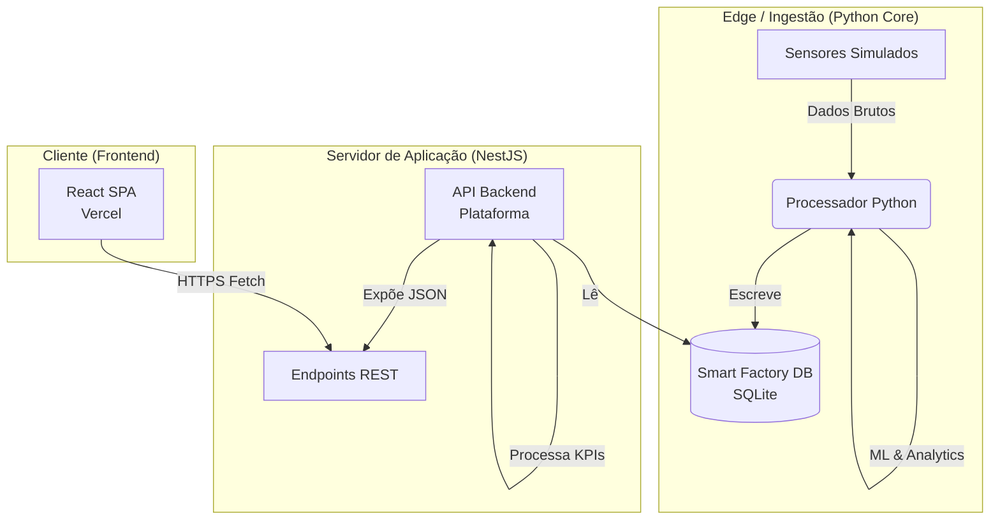

# Arquitetura de Conexão e Servidores - Smart Factory

Este documento descreve a estrutura modelada para a comunicação entre os componentes do sistema Smart Factory, cobrindo tanto o ambiente de desenvolvimento local quanto a estratégia de conexão com servidores de produção (Deploy).

## 1. Visão Geral (Arquitetura Híbrida)

O sistema opera em uma arquitetura de três camadas, projetada para desacoplar a ingestão de dados pesada (Python/IoT) da apresentação leve (React).

### Diagrama Conceitual (Mermaid)

## 2. Componentes e Conectividade

### 2.1. Camada de Dados (Edge / Core)
- **Tecnologia**: Python 3.
- **Função**: Simula o "chão de fábrica". Gera dados de sensores, executa modelos de Machine Learning (Random Forest) para predição de falhas e calcula métricas brutas.
- **Conexão**: 
  - Não expõe portas externas.
  - Comunica-se exclusivamente via **Sistema de Arquivos** (escrevendo no `smart_factory.db`).
  - Isso simula um ambiente industrial onde o Edge Computing processa dados e os salva em um banco central/local.

### 2.2. Camada de API (Backend Server)
- **Tecnologia**: NestJS (Node.js).
- **Hospedagem**: Render (Cloud) ou Localhost.
- **Função**: Atua como Gateway de Dados. Transforma os registros brutos do banco de dados em informações consumíveis (JSON) para o frontend.
- **Conexão**:
  - **Entrada**: Lê o arquivo SQLite (`DATABASE_PATH`).
  - **Saída**: Expõe API HTTP (Porta 3000 local ou HTTPS prod).
  - **Endpoints Principais**:
    - `/sensores`: Leituras em tempo real.
    - `/kpis`: OEE, MTBF, MTTR calculados.
    - `/alertas`: Riscos críticos detectados.

### 2.3. Camada de Apresentação (Frontend Client)
- **Tecnologia**: React + Vite + Tailwind.
- **Hospedagem**: Vercel.
- **Função**: Interface visual para o operador.
- **Conexão**:
  - Realiza requisições HTTP (`fetch`) para a API.
  - **Dinâmica de URL**:
    - **Local**: Conecta em `http://localhost:3000`.
    - **Produção**: Conecta em `https://smart-factory-api-kox6.onrender.com` (Configurado via variável de ambiente `VITE_API_URL`).

## 3. Estratégia de Deploy e Sincronização

A "sincronicidade" mencionada refere-se à capacidade do sistema de manter os dados consistentes entre o processamento (Python) e a visualização (React), independentemente de onde estejam rodando.

1.  **Persistência Única**: Como ambos (Python e NestJS) compartilham o acesso ao banco de dados (Volume Docker ou Arquivo Local), não há "delay" de sincronização de rede entre ingestão e API. Assim que o Python escreve, o NestJS pode ler.
2.  **Variáveis de Ambiente**:
    - O Frontend usa `import.meta.env.VITE_API_URL` para saber automaticamente se deve falar com o servidor local ou o servidor na nuvem (Render).
    - Isso permite que o mesmo código fonte funcione em ambos os ambientes sem alterações manuais.

## 4. Fluxo de Atualização (CI/CD Simplificado)

Quando uma alteração é feita (ex: Novos KPIs OEE/MTBF):
1.  **Código**: Alteramos `analytics.py` (cálculo), `app.service.ts` (API) e `KPICards.tsx` (Visual).
2.  **Push**: Ao enviar para o GitHub (`git push`).
3.  **Build Automático**:
    - A **Vercel** detecta a mudança no Frontend e faz o redeploy automático.
    - O **Render** detecta a mudança no Backend e reinicia o serviço NodeJS.
4.  **Resultado**: O usuário final acessa a URL da Vercel e vê os dados atualizados, vindos da nova API do Render.
