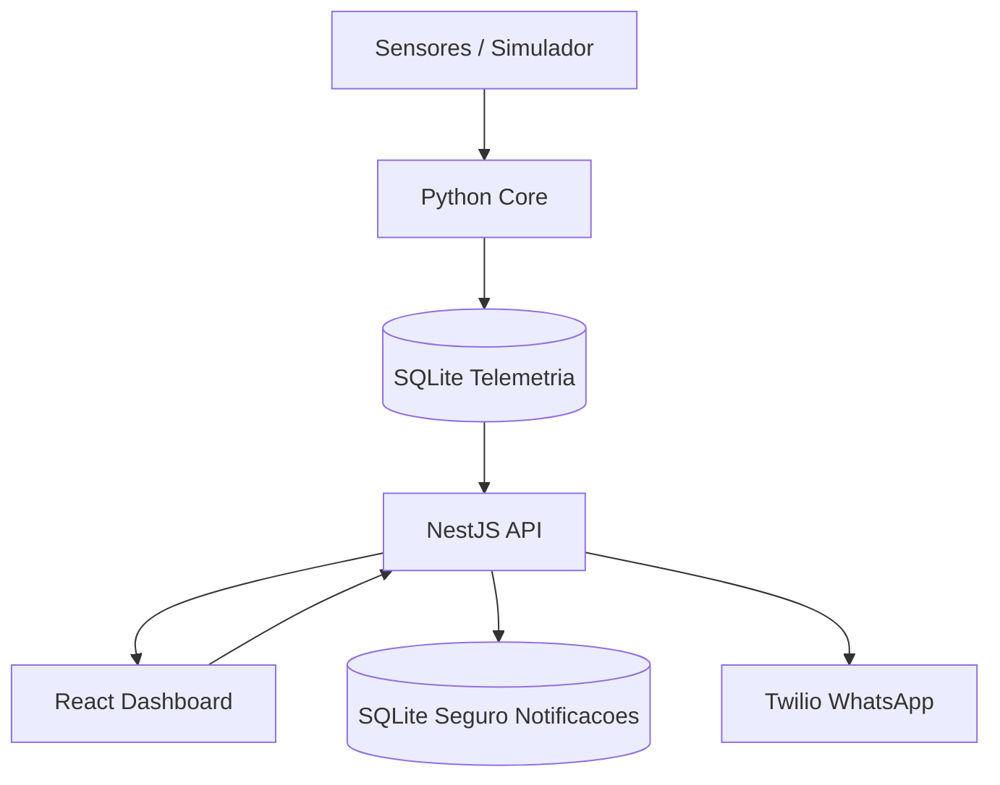

# Arquitetura de Conexao e Servidores - Smart Factory

Este documento descreve a comunicacao entre Python Core, API NestJS, dashboard React/Vite e o modulo seguro de notificacoes WhatsApp.

## 1. Visao Geral

O sistema usa uma arquitetura hibrida:

- Python Core para simulacao industrial, processamento e IA.
- SQLite principal para telemetria operacional.
- NestJS como gateway REST e orquestrador de inferencia.
- SQLite separado para configuracoes sensiveis de notificacao.
- React + Vite como interface operacional.


```mermaid
graph TD
    A[Sensores / Simulador] --> B[Python Core]
    B --> C[(SQLite Telemetria)]
    C --> D[NestJS API]
    D --> E[React Dashboard]
    E --> D
    D --> F[(SQLite Seguro Notificacoes)]
    D --> G[Twilio WhatsApp]
```

## 2. Backend NestJS

Responsabilidades:

- expor sensores, KPIs, alertas e inferencia;
- servir o assistente inteligente;
- configurar notificacoes sem expor segredos ao frontend;
- enviar WhatsApp via Twilio quando as credenciais existem;
- registrar eventos de notificacao com cooldown.

Endpoints relevantes:

- `GET /sensores`
- `GET /kpis`
- `GET /alertas`
- `POST /assistant/chat`
- `POST /predict-failure`
- `POST /detect-anomaly`
- `GET /equipment/:id/risk`
- `GET /notifications/config`
- `POST /notifications/config`
- `POST /notifications/test`

## 3. Frontend React + Vite

O frontend usa chamadas relativas e proxy do Vite em desenvolvimento. Ele nao carrega tokens, telefone completo, SID Twilio nem URL sensivel de API no bundle.

Seguranca aplicada:

- `VITE_API_URL` removido do fluxo principal;
- Vite com `allowedHosts` explicito;
- tunnel habilitado apenas com `VITE_ENABLE_TUNNEL=true`;
- avatar externo removido para evitar chamada a terceiros;
- CSP e `referrer=no-referrer` no `index.html`.

## 4. Notificacoes Seguras

O modulo de notificacoes usa um banco separado:

```text
secure-data/notification_config.db
```

O telefone do destinatario e criptografado em repouso com AES-256-GCM. A UI recebe apenas uma versao mascarada:

```text
whatsapp:+********5678
```

Credenciais Twilio ficam apenas no backend:

```text
TWILIO_ACCOUNT_SID
TWILIO_AUTH_TOKEN
TWILIO_WHATSAPP_NUMBER
NOTIFICATION_ENCRYPTION_KEY
```

## 5. CORS e Tunnel

O backend nao libera `.trycloudflare.com` automaticamente. Para liberar um tunnel publico, configure explicitamente:

```text
CORS_TUNNEL_ORIGINS=https://seu-tunnel.trycloudflare.com
```

No Vite, habilite hosts de tunnel somente quando necessario:

```text
VITE_ENABLE_TUNNEL=true
VITE_ALLOWED_HOSTS=seu-host-adicional
```

## 6. Evolucao Enterprise

Para producao industrial:

- substituir SQLite por PostgreSQL/TimescaleDB;
- usar Vault/Secret Manager para Twilio e chaves;
- adicionar OIDC/JWT e RBAC;
- aplicar rate limiting e auditoria por usuario;
- separar servico de notificacoes em worker assincrono;
- adicionar fila, retry e dead-letter para mensagens;
- registrar trilha de auditoria por planta, equipamento e usuario.
